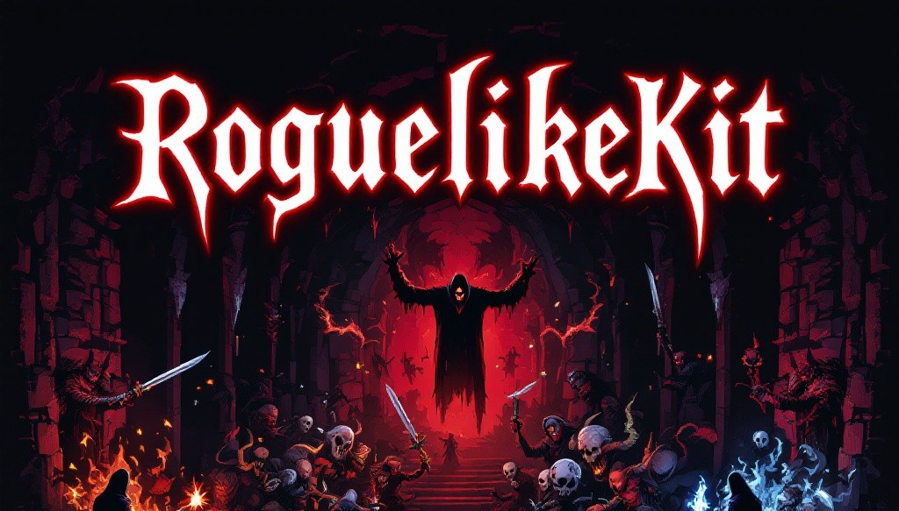
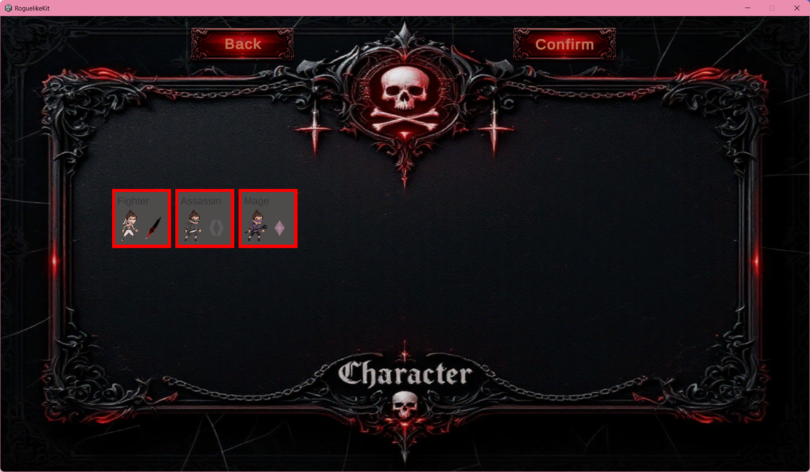
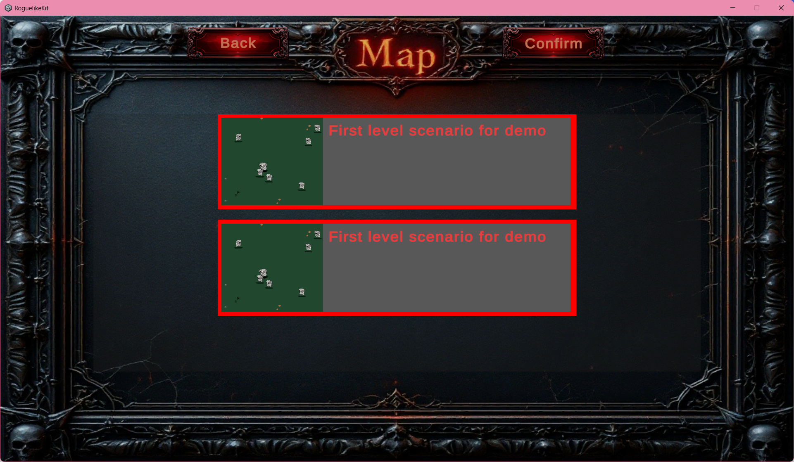
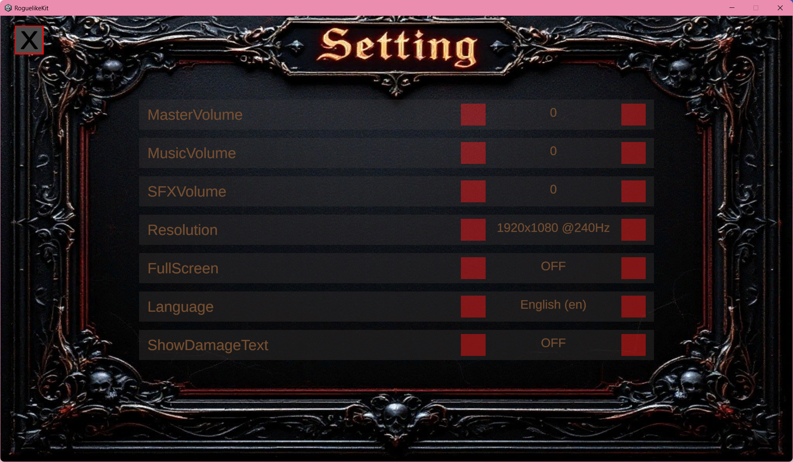
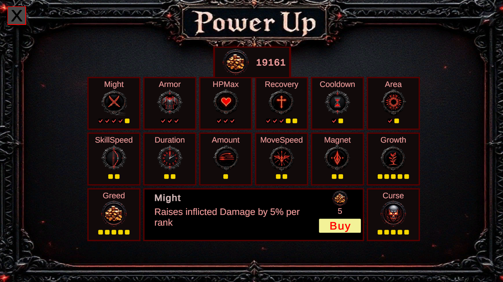
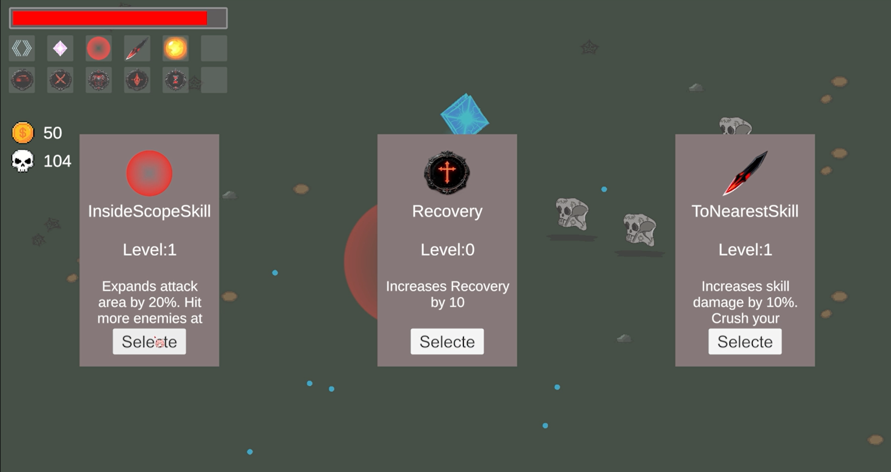
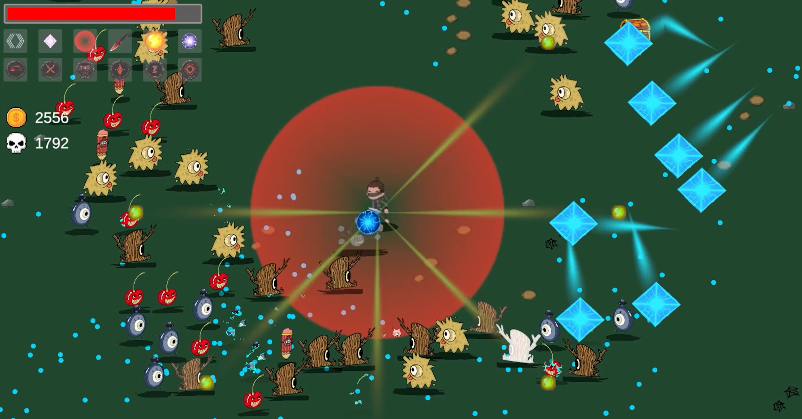

# Survivors Roguelike Kit

Build your own Vampire Survivors-style game in Unity with a complete, open-source project template.


A complete Unity 2D survivors-like roguelike game template, originally released as a Unity Asset Store asset.

Survivors Roguelike Kit is a modular Unity project for building 2D survivor-style roguelike games. It includes a playable game loop, character and level selection, skills, enemies, buffs, loot, procedural stage spawning, and ScriptableObject-driven configuration workflows.

This project is now open source so developers can learn from it, extend it, and use it as a foundation for their own games.

## Preview




| Character Select | Level Select |
| --- | --- |
|  |  |

| Settings | Power Up |
| --- | --- |
|  |  |

| Skill Upgrade | Combat |
| --- | --- |
|  |  |

## Features

- Complete 2D survivors-like roguelike game template
- ScriptableObject-driven game architecture
- Modular combat and skill system
- Active skills, passive attribute skills, and evolution weapons
- Buff system with burn, freeze, slow, and other examples
- Enemy system with melee, ranged, and charge behaviours
- Procedural stage spawning with multiple spawn patterns
- Procedural map configuration with weighted tile generation
- EXP, loot, pickup, and level-up systems
- Character selection and level selection UI
- Floating damage number display
- Save, settings, object pooling, and event-channel based runtime systems
- Built for fast prototyping through the Unity Inspector

## Requirements

- Unity 6
- Built-in Render Pipeline
- DOTween, already included in this project

## Quick Start

You can clone this repository directly and open it with Unity Hub using Unity 6.

This project uses Unity's Built-in Render Pipeline by default.

```bash
git clone https://github.com/Roo-Roo-Roo/survivors-roguelike-kit.git
```

If you want to import the kit into your own Unity project, use the release package from the GitHub Releases panel on the right side of this repository page.

I plan to provide separate release packages for:

- Unity 2021
- Unity 2022
- Unity 6

Read the installation and import guide here:

https://roofen-game.gitbook.io/roofen-game/survivors-roguelike-kit/quick-start

In general:

1. Clone this repository and open it with Unity Hub, or import a release package into your own Unity project.
2. Use a Unity project with the Built-in Render Pipeline.
3. Open the initialization scene.
4. Press Play.

## Documentation

Full documentation:

https://roofen-game.gitbook.io/roofen-game/survivors-roguelike-kit

Useful topics include:

- Core concepts overview
- Adding a new playable character
- Adding a new enemy
- Adding a new stage configuration
- Adding a new map configuration
- Adding a new level
- Adding a new attack skill
- Adding a new buff
- Configuring the EXP system

## Commercial Support

This project is free and open source.

I am available for freelance Unity work, including:

- Bug fixing
- Gameplay systems
- Game customization
- Prototype development
- Unity project integration
- Custom game development

Contact:

- Email: wufengovo@gmail.com
- PayPal donation: https://paypal.me/roorooroo999

中文支持：

如果你需要 Unity 项目外包、Bug 修复、玩法系统定制、游戏定制开发、原型开发或商业项目集成支持，可以通过邮箱联系我。

- 邮箱：wufengovo@gmail.com
- PayPal 捐赠：https://paypal.me/roorooroo999

## License

This project is released under the MIT License.

Please check third-party assets and dependencies separately.

## Third-Party Notice

DOTween is the only third-party plugin currently included in this project.

If you use this project for commercial work, please obtain the appropriate DOTween license from the official DOTween website:

https://dotween.demigiant.com/

The pixel art assets and UI assets were generated with AI tools.

The hand-drawn style assets were created by the project author.
